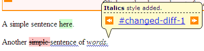
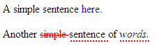

# Html Presentation

By default Daisy Diff is using the [Dojo Toolkit](http://www.dojotoolkit.org/) for presentation of the html output. This offers annotation tooltips on the result that allow the user to move back and forth between differences.

Default Values are

  * Added text is shown in green background
  * Removed text is shown in red background
  * Formatted text is shown with a blue underline and tooltip
  * Special styles for images that show coloured layers

Here is an example (HTML mode):



# Changing the default styles

You can change the default presentation by updating (or replacing) the CSS used by the resulting file. Open the `diff.css` file to look at the present values.

Inside the file you will see several CSS declarations such as

  1.  span.diff-html-removed (removed text in html mode)
  2.  span.diff-html-added (added text in html mode)
  3.  span.diff-html-changed (formatted text in html mode)

Override/Change this values are you are free to customize the presentation!

# Simple Example

Let's assume that instead of the default values you want to have the following

  1.  blue text for additions
  2.  red strike-through text for removals
  3.  dotted underlines for formatting changes
  4.  default values for the images

You modify the css file as below

```
span.diff-html-removed { color: red; text-decoration: line-through; cursor: default; }
span.diff-html-added { color: blue; cursor: default; }
span.diff-html-changed { color: black; border-bottom: dotted 2px red; cursor: default; text-decoration: none; }
```

and now you have the requested result!

